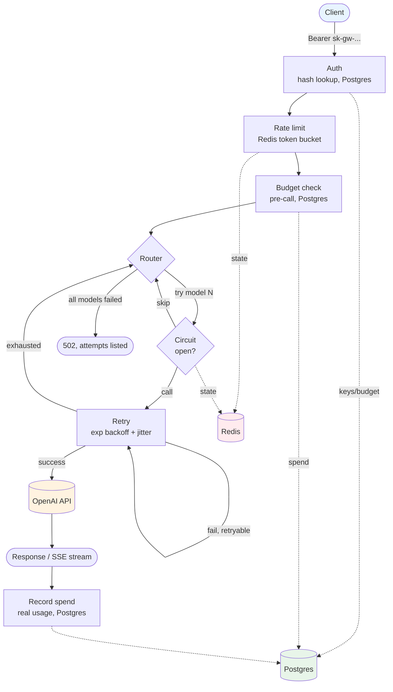

# LLM Gateway


API proxy in front of OpenAI — one schema, retries, model-to-model
fallback (e.g. gpt-4o → gpt-4o-mini), rate limiting, per-key budgets,
gateway-issued auth.

See `tasks/todo.md` for day-by-day build status and design notes.

## Architecture



Auth, rate limiting, and budget enforcement all run **once per request**,
before any model is attempted — a rejected request never reaches the
router. Retry and the circuit breaker operate **per model**, inside the
router's fallback loop: a model's own failures don't affect a different
model's circuit. Streaming follows the identical path up through the
first chunk; after that, no further fallback — a mid-stream failure ends
the response instead of silently switching models.

## Stack
Python 3.11+ · FastAPI (async) · httpx (OpenAI only) · tenacity · Redis ·
PostgreSQL (SQLAlchemy 2.0 async + asyncpg + Alembic) · structlog ·
pytest + respx · Docker Compose

## Local setup (from scratch)

```bash
# 1. clone / cd into the repo (see "Push to GitHub" below if you haven't made one yet)
cd llm-gateway

# 2. create and activate a virtualenv
python3 -m venv .venv
source .venv/bin/activate        # Windows: .venv\Scripts\activate

# 3. install dependencies (requirements-dev.txt adds pytest/fakeredis/etc
#    on top of requirements.txt — use requirements.txt alone for a prod-only install)
pip install -r requirements-dev.txt

# 4. copy env template and fill in provider keys
cp .env.example .env
# edit .env: OPENAI_API_KEY=...

# 5. run the test suite (uses SQLite + fakeredis, no external services needed)
pytest -v

# 6. install and start Redis (needed to actually run the app, not just tests)
brew install redis
brew services start redis
redis-cli ping   # should print PONG

# 7. (optional, for exploring the API locally without installing Postgres)
#    point the app at a throwaway SQLite file and run the migration:
export DATABASE_URL="sqlite+aiosqlite:///./dev.db"
alembic upgrade head

# 8. boot the app
uvicorn app.main:app --reload
# then in another terminal:
curl http://localhost:8000/health

# key creation, listing, and revocation require ADMIN_API_KEY (set in .env)
curl -X POST http://localhost:8000/v1/keys \
  -H "Content-Type: application/json" \
  -H "Authorization: Bearer <your ADMIN_API_KEY>" \
  -d '{"name": "my key", "budget_limit_usd": 1.00}'
curl http://localhost:8000/v1/keys -H "Authorization: Bearer <your ADMIN_API_KEY>"
curl -X DELETE http://localhost:8000/v1/keys/<key id> -H "Authorization: Bearer <your ADMIN_API_KEY>"

# the key itself (not the admin secret) is used for everything else:
curl http://localhost:8000/v1/keys/me -H "Authorization: Bearer <api_key from creation>"
curl -X POST http://localhost:8000/v1/chat/completions \
  -H "Content-Type: application/json" \
  -H "Authorization: Bearer <api_key>" \
  -d '{"model": "gpt-4o", "fallback_models": ["gpt-4o-mini"], "messages": [{"role": "user", "content": "hello"}]}'

# streaming: add "stream": true, use -N (curl won't buffer) to see chunks arrive live
curl -N -X POST http://localhost:8000/v1/chat/completions \
  -H "Content-Type: application/json" \
  -H "Authorization: Bearer <api_key>" \
  -d '{"model": "gpt-4o-mini", "messages": [{"role": "user", "content": "hello"}], "stream": true}'
```

Streamed chunks are Server-Sent Events in the gateway's own shape (not a
raw passthrough of OpenAI's wire format) — `{"id", "model", "provider",
"choices": [{"delta": {"role"|"content"}, "finish_reason"}], "usage"}`,
ending with a `data: [DONE]` line. Fallback/retry only apply BEFORE the
first chunk is sent; once a stream has started, a failure ends it with a
single error event rather than silently switching models mid-response.

`budget_limit_usd` is optional — omit it for an unlimited key. Once a
key's `spent_usd` (tracked from real post-call token usage) reaches its
limit, further requests get a 402 until the limit is raised.

Admin endpoints (`POST`/`GET`/`DELETE /v1/keys`) refuse ALL requests if
`ADMIN_API_KEY` isn't set in `.env` — that's intentional (fail closed,
not open) — see `app/core/admin_auth.py`.

`/health` needs no database or Redis. `/v1/keys` and `/v1/keys/me` need
Postgres or SQLite as above. `/v1/chat/completions` additionally needs
Redis running (Day 7's rate limiter) — without it, that endpoint will
fail to connect rather than silently skip rate limiting.

## Docker Compose (runs everything with one command)

```bash
cp .env.example .env
# edit .env: OPENAI_API_KEY=...

docker compose up --build
```

This builds the gateway image and starts Postgres, Redis, runs the
Alembic migrations once (as a one-shot `migrate` service), then starts
the gateway — all wired together, no manual `brew services start` or
`export DATABASE_URL=...` needed. The gateway listens on
`http://localhost:8000`, same as running it manually.

**Honest caveat**: this Compose setup has not been build-tested end to
end (see `tasks/todo.md`'s Day 9-10 section for why). The YAML is valid
and the dependency chain (Postgres/Redis healthy -> migration completes
-> gateway starts) is correct in principle, but the first real
`docker compose up --build` run against this repo is genuinely untested.
Expect to possibly hit and fix something on the first run — that's normal
for any freshly-written Dockerfile/Compose setup, not a sign of a deeper
problem.

## Load testing

```bash
python scripts/load_test.py --api-key <your gateway api_key> --requests 20 --concurrency 4
```

Sends real requests against a real running gateway (which calls real
OpenAI) — costs a small amount of real money on the defaults above.
Reports latency percentiles, throughput, and a status-code breakdown, so
you can watch the Redis-backed rate limiter and circuit breaker hold up
correctly under genuinely concurrent load, not just the sequential
requests the test suite's mocked tests exercise. Point `--url` at a
different host to test a deployed instance instead of localhost.

## Push to GitHub (first time)

```bash
git init
git add .
git commit -m "Day 1-2: project scaffold, unified schema, OpenAI adapter"

# create an empty repo on github.com first (no README/gitignore/license —
# we already have them), then:
git remote add origin git@github.com:<your-username>/llm-gateway.git
git branch -M main
git push -u origin main
```

## Project structure
```
llm-gateway/
├── .env.example
├── .gitignore
├── .dockerignore
├── .github/
│   └── workflows/
│       └── tests.yml            # CI: runs pytest on every push/PR
├── Dockerfile
├── docker-compose.yml
├── alembic.ini
├── requirements.txt
├── requirements-dev.txt
├── alembic/
│   ├── env.py                    # async migrations, URL from Settings
│   └── versions/
│       ├── 0001_create_api_keys.py
│       └── 0002_rename_budget_columns_to_micros.py
├── app/
│   ├── main.py                  # FastAPI app, /health, keys router
│   ├── core/
│   │   ├── config.py             # pydantic-settings, env-driven config
│   │   ├── db.py                 # async engine/session, get_db dependency
│   │   ├── security.py           # API key generation + hashing
│   │   ├── auth.py               # get_current_api_key dependency
│   │   ├── admin_auth.py         # require_admin dependency, fail-closed
│   │   ├── adapters.py           # get_openai_adapter singleton
│   │   ├── circuit_breaker.py    # per-model CircuitBreaker, Redis-backed (Day 5, moved to Redis after Day 7)
│   │   ├── resilience.py         # call_model: retry + circuit breaker (Day 5)
│   │   ├── rate_limiter.py       # Redis token bucket, per API key (Day 7)
│   │   ├── token_estimate.py     # pre-call token estimate for rate limiting (Day 7)
│   │   ├── pricing.py            # hardcoded OpenAI $/token rates (Day 8)
│   │   ├── budget.py             # budget check + atomic spend recording (Day 8)
│   │   ├── logging_config.py     # structlog setup: JSON in prod, console in dev
│   │   └── request_logging.py    # RequestLoggingMiddleware, request_id correlation
│   ├── schemas/
│   │   └── chat.py               # unified ChatCompletionRequest/Response
│   ├── models/
│   │   ├── base.py               # SQLAlchemy DeclarativeBase
│   │   └── api_key.py            # APIKey ORM model
│   ├── adapters/
│   │   ├── base.py               # ProviderAdapter interface, ProviderError
│   │   └── openai.py             # OpenAIAdapter
│   └── routers/
│       ├── keys.py               # POST /v1/keys, GET /v1/keys/me
│       └── chat.py               # POST /v1/chat/completions (fallback routing, budget)
├── scripts/
│   └── load_test.py             # concurrent load test against a running gateway
└── tests/
    ├── conftest.py                # in-memory SQLite fixtures
    ├── test_openai_adapter.py
    ├── test_security.py
    ├── test_logging_config.py
    ├── test_admin_auth.py
    ├── test_keys_router.py
    ├── test_chat_router.py
    ├── test_circuit_breaker.py
    ├── test_resilience.py
    ├── test_rate_limiter.py
    ├── test_pricing.py
    └── test_budget.py
```
